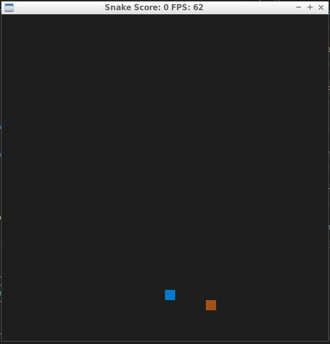
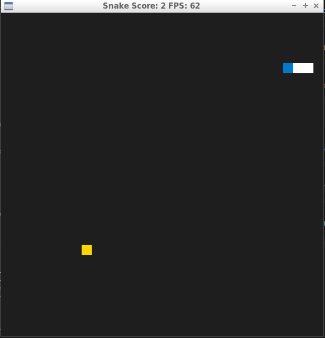
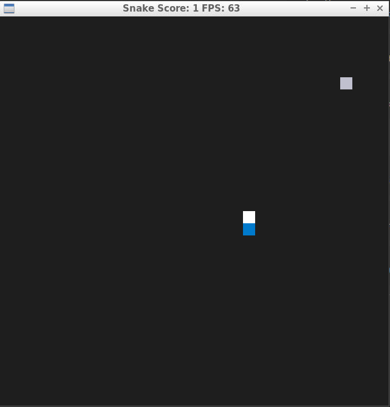

# CPPND: Capstone Snake Game 



## New Fearues added
```cpp
class Food {
  public:
    enum class State { normal, silver, golden };
    Food():state(State::normal), counter(0){};
    State getState(){ return state; };
    void updateState();
    void counterAdd();
    void counterClear(){ counter = 0; };
    int getCounter(){ return counter; };
    SDL_Point place;
 private:
    State state;
    int counter;
};
```


## Dependencies for Running Locally
* cmake >= 3.7
  * All OSes: [click here for installation instructions](https://cmake.org/install/)
* make >= 4.1 (Linux, Mac), 3.81 (Windows)
  * Linux: make is installed by default on most Linux distros
  * Mac: [install Xcode command line tools to get make](https://developer.apple.com/xcode/features/)
  * Windows: [Click here for installation instructions](http://gnuwin32.sourceforge.net/packages/make.htm)
* SDL2 >= 2.0
  * All installation instructions can be found [here](https://wiki.libsdl.org/Installation)
  >Note that for Linux, an `apt` or `apt-get` installation is preferred to building from source. 
* gcc/g++ >= 5.4
  * Linux: gcc / g++ is installed by default on most Linux distros
  * Mac: same deal as make - [install Xcode command line tools](https://developer.apple.com/xcode/features/)
  * Windows: recommend using [MinGW](http://www.mingw.org/)

## Basic Build Instructions

1. Clone this repo.
2. Make a build directory in the top level directory: `mkdir build && cd build`
3. Compile: `cmake .. && make`
4. Run it: `./SnakeGame`.

## Rubric Points
### Required
* A README with instructions is included with the project
* The README indicates which project is chosen
* The README includes information about each rubric point addressed.
* The submission must compile and run.
### Optional
* The project demonstrates an understanding of C++ functions and control structures. A variety of control structures are used in the project. The project code is clearly organized into functions.<br>
*Yes, it can be clearly observerd in the code.*
* Class constructors utilize member initialization lists.
*e.g. In game.cpp, game object constructor used initialization list; In food.h, the food obj constructor also used the initialization list*
* The project accepts user input and processes the input.
*e.g. in controller.cpp, the controller can accept the keyboard input.*
  
* The project uses Object Oriented Programming techniques.All class data members are explicitly specified as public, protected, or private.
*Yeah, it can be verified in all the header files.*
* Classes use appropriate access specifiers for class members.
*e.g. In gmae.h,  getScore() is a accessor for a class member; In food.h, getCounter() is also an accessor*
* Classes encapsulate behavior.
*e.g. In food.h, the food's state is encapsulated. It can be accessed by only using the accessor.*
